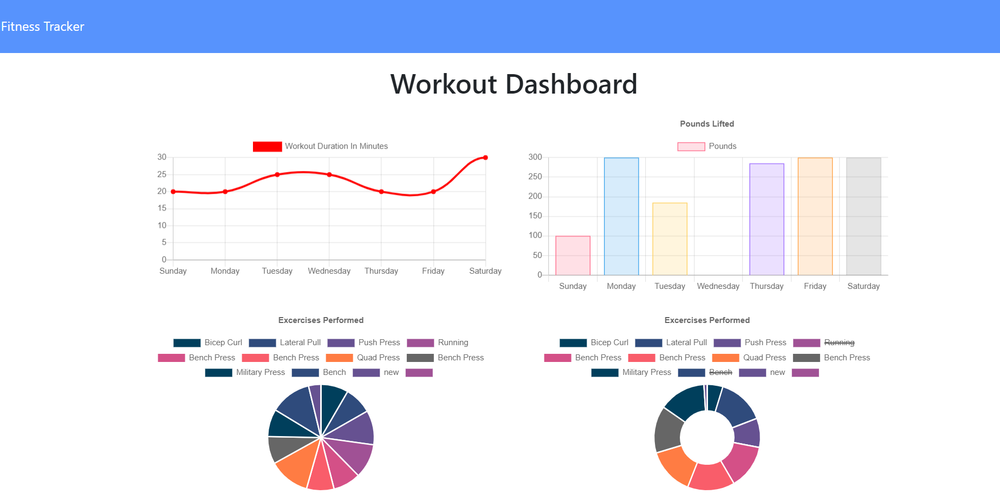

# Fitness-Tracker
This is a fitness tracker app it is used to track your fitness like no sets, km run, sets done, type of excercise etc.

## Installation
Git clone the repo on your local computer and run server.js in Git bash shell.

## Usage 
Go to open Bash 

Do NPM i & press enter

Do node server & press enter

Go to browser and type what is under node server & press enter

Main page 

select continue work out or new workout  & fill in details and press add excercise or complete

Excercise added

View Stats by clicking view dashboard or going to http://localhost:3000/stats 

